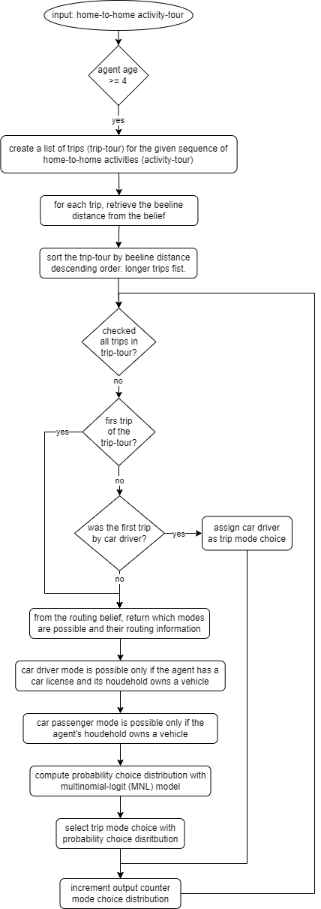

## Agent-Based Simulation of Human Mobility Behaviour

**Utrecht University, The Netherlands. 2022 - 2023**

Author: Marco Pellegrino

Contributors: Jan de Mooij, Tabea Sonnenschein, Mehdi Dastani, Dick Ettema, Brian Logan, Judith A. Verstegen

### Brief introduction

The system is built on the Belief-Desire-Intention (BDI) agent framework, which provides a foundation for modelling intelligent agents' behaviour and decision-making processes. The primary objective of the simulation is to model and simulate the mode choice, i.e., the selection of a means of transport, for each trip that occurs between two activities.

### Activity tours

Considering the simulation of private transport, it is indeed necessary to implement a constraint that prevents agents from driving a car if they have previously left home without it. Simulating mode choice for each trip independently is not a suitable solution in this context. To address this, agents reason and select mode choices within groups of activities where the first and last activity within the group is staying at home. Such a group of activities represents a tour of trips that starts and ends at the agent's home location. This ensures that agents can always consider car availability at the beginning of their reasoning process. Further constraints on car usage such as car availability attribute from the synthetic population, or trips ordering, as explained in the "Mode choice selection for trip tours" section, are also implemented to refine and control the behaviour of agents.

### Activity tours as goals

Within the Sim2APL framework, agents adopt [`home-to-home activity tours`](src/main/java/nl/uu/iss/ga/model/data/ActivityTour.java) as their goals. As a result, each day, agents receive a trigger for the home-to-home goals of the day, which prompt them to execute the corresponding [`plan`](src/main/java/nl/uu/iss/ga/simulation/agent/plan/activity/ExecuteTourPlan.java). In these plans, the [`home-to-home trip tours`](src/main/java/nl/uu/iss/ga/model/data/TripTour.java) are computed, and the mode choices for each trip within the tour are simulated.

### Simulation Initialisation

When launching the simulation, the platform undergoes the following operations to prepare for execution:

[`Initialise Counters`](src/main/java/nl/uu/iss/ga/util/tracking/ModeOfTransportTracker.java) for Output:

*   Various counters for output metrics, such as mode choice distribution, are initialised to track and record simulation results.

Initialise Agents' Demographics and Weekly Activity Schedule:

*   Agents' demographics and their weekly [`activity schedules`](src/main/java/nl/uu/iss/ga/model/reader/ActivityFileReader.java) are loaded from a file to populate the simulation with realistic individual characteristics and routines.

Initialise Travel Information and [`Transport Model Parameters`](src/main/java/nl/uu/iss/ga/model/reader/MNLparametersReader.java):

*   Travel information, including data on different locations and available transportation options, and transport model parameters, are loaded from a file to inform agents' travel decisions.

For each agent, the following steps are [`executed`](src/main/java/nl/uu/iss/ga/util/config/ConfigModel.java):

Group Same-Day Activities into Home-to-Home Tours (Activity-Tours):

*   The agent's daily activities that occur on the same day are grouped together to form home-to-home tours, representing a logical sequence of activities for the agent.

Add Visited Locations' Travel Information to the Agent's Travel Belief:

*   For each activity-tour, the travel information for the visited locations, such as travel time, mode options, and associated costs, is added to the agent's travel belief. This information influences the agent's mode choice decisions.

Adopt the Activity Tour as a Goal:

*   The agent adopts the activity-tour as a goal, aiming to accomplish the series of activities in the specified order, considering travel options and constraints.

## Mode choice selection for trip tours

Such section is represented by [`ExecuteTourPlan.java`](src/main/java/nl/uu/iss/ga/simulation/agent/plan/activity/ExecuteTourPlan.java).  
For each home-to-home activity tour, agents follow a sequence of operations:

Agents younger than 4 years old are not included in the simulation because of their inability of walking and using any means of transport independently.

Building upon the information introduced in Section "Activity tours", this section provides further details on the implementation of constraints to prevent agents from using a car as a means of transport if they have already left home using another mode of transportation.

The trip tour is sorted in a decreasing order based on the beeline distance. The Haversine (or great circle) distance is used as a beeline, representing the angular distance between two points on a sphere's surface. This method is preferred over Euclidean distance as it considers the curvature of the Earth, resulting in a more accurate distance calculation. Distances are pre-calculated and loaded via file in the simulation initialisation.

The trip ordering is intuitive, as the agent is more likely to choose the car as the driver for the longest leg of the tour. If the agent selects the car driver mode for this longest leg, the same mode choice is then applied to all the remaining legs of the tour. This ensures that agents cannot take the car for one leg of the tour only while being far from home. The car must always be taken from home and returned home.

On the other hand, if the agent does not select the car driver mode for the longest leg, they will no longer have the option to choose the car driver mode for the rest of the tour. This constraint ensures that once an agent has chosen an alternative mode of transportation, they cannot switch to the car driver mode.

Furthermore, it is important to note that the car driver mode is filtered based on the agent's car license and household vehicle ownership attributes. In addition, the car passenger mode is available only to agents with a household owning a car.

## Transport model
The probability mode choice distribution is computed using a [`multinomial logit (MNL) model`](src/main/java/nl/uu/iss/ga/util/MNLModalChoiceModel.java). Utilities are scored for each mode and the probability mode choice distribution is computed.
Coefficients can be initialised with any value desired. This can also be used for sensitivity analysis and calibration.
The parameter sets file needs to be specified by the command line with the argument `parameter_file`. In addition, each row of this file is a different parameter set (useful when iteratively running different parameter sets for sensitivity analysis or calibration). Hence, the argument `parameterset_index` specifies the index within such file.
[`baselines_parameterset.csv`](src/main/resources/baseline_parameterset/parameterset.csv) contains the a parameter set where all the values are neutral. 